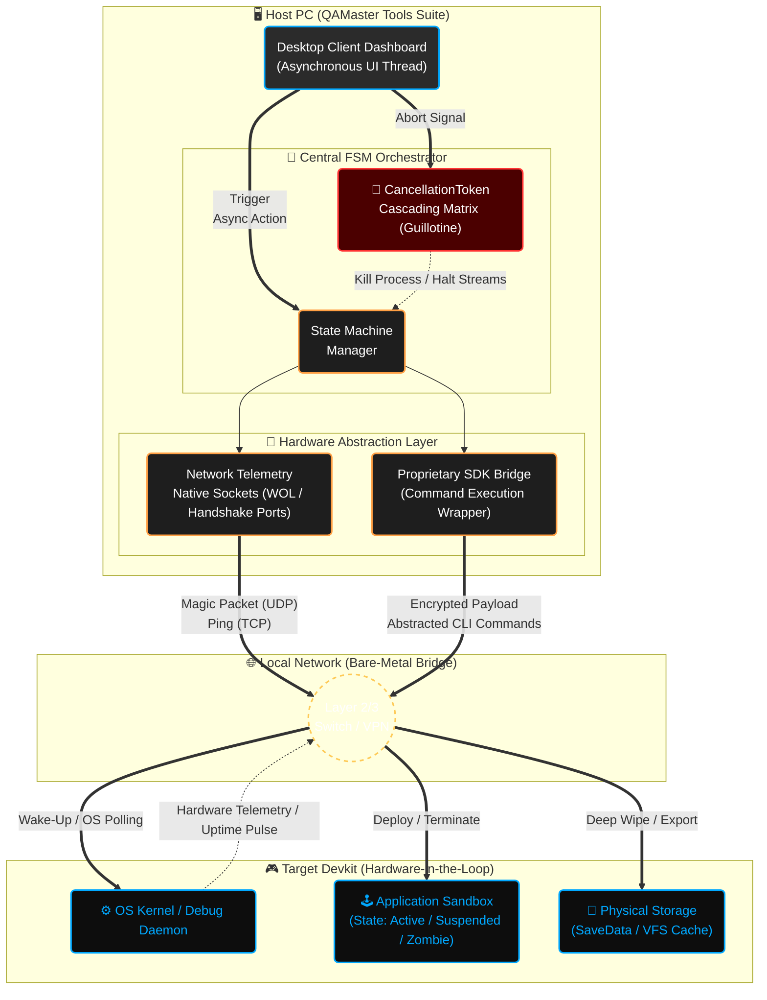
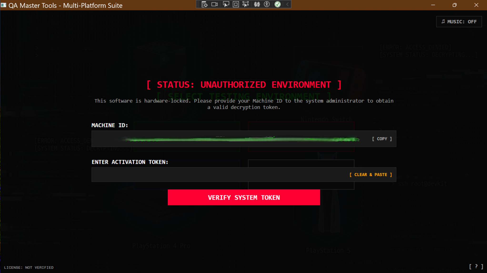
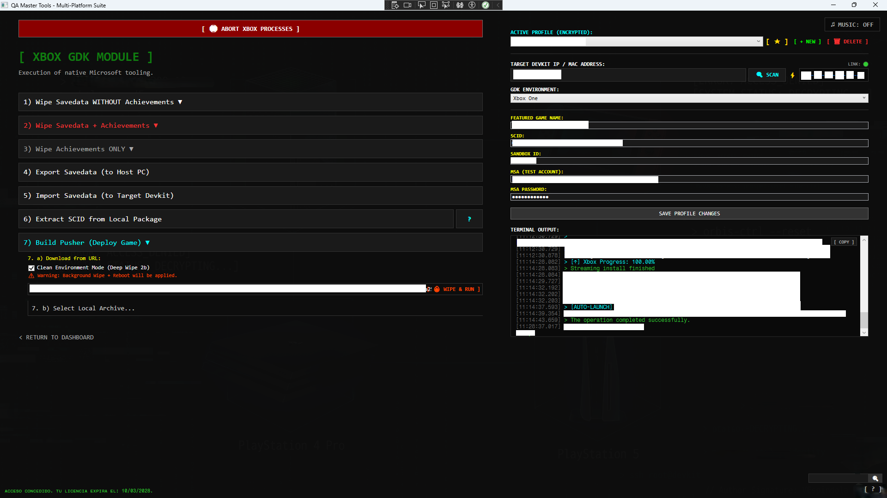

# ⚙️ HITL Zero-Touch Orchestrator: Devkit Automation Framework


> ⚠️ LEGAL DISCLAIMER
> Due to strict Non-Disclosure Agreements (NDAs) regarding proprietary first-party SDKs (Sony, Microsoft, Nintendo) and unreleased AAA intellectual property, the true source code for this project cannot be made public at all. 
> 
> This repository serves as a System Architecture Showcase. Its purpose is to demonstrate enterprise-grade engineering practices, asynchronous workflow design, Hardware-in-the-Loop (HITL) orchestration, and readiness for AI-assisted QA pipelines.

---

## 📖 1. The Engineering Thesis

In high-volume AAA game testing, manual console provisioning is a massive bottleneck. QA engineers lose countless hours dealing with SDK command-line interfaces, network timeouts, ghost processes blocking disk I/O, and unpredictable hardware states. 

This framework treats bare-metal game consoles as Finite State Machines (FSM). It abstracts highly complex, multi-step CLI routines into single-click, mathematically predictable state transitions. By injecting CI/CD deployment principles locally, it reduces devkit configuration time by over 95% while eliminating human error.


---

## 🏗️ 2. Architectural Highlights & Solutions

Building a robust bridge between a Windows host and proprietary devkits introduces severe multi-threading and I/O challenges. This tool was built to survive the chaos of physical QA labs.

### 🛡️ Cascading Abort Protocol (The "Zero-Zombie" Matrix)
Aborting a massive 80GB build extraction or an SDK payload mid-flight traditionally leaves "zombie" threads consuming RAM and locking files. 
* 🧠: The Solution: A strictly managed CancellationTokenSource matrix. Triggering a global abort immediately broadcasts a cancellation exception through the entire logical tree—halting HttpClient streams, nested Task.Delay loops, and OS-level SDK executions in under 1 second, restoring host stability with zero memory leaks.

### 🚦 Pre-Flight State Synchronization
Sending format or install commands while a target console is silently running a background process causes kernel-level access violations.
* :point_right: The Solution: The framework queries the target's active memory pool before executing destructive commands. If a process is detected, it forces a safe RAM dump (suspend) followed by a strict OS terminate, guaranteeing 100% clean disk I/O.

### 💾 Safe Asynchronous Unpacking
Decompressing large .xvc or .pkg builds asynchronously can silently corrupt host hard drives if space runs out mid-extraction.
* 🧮 The Solution: An early HTTP Header inspection module calculates the required decompression footprint (3x multiplier of the ContentLength) and pre-validates host disk availability before opening any data streams.

---

## 💻 3. Code Showcase: Resilient Hardware Polling

To demonstrate the underlying C# architecture without breaching NDAs, below is a sanitized snippet of the Hardware Orchestrator module. 

This specific routine ensures target hardware is physically awake, responsive at the kernel level, and accessible via TCP before injecting deployments. It showcases advanced System.Threading concepts, including Linked Tokens, Competitive Asynchronous Tasks, and Fire-and-Forget Re-injections to handle unstable local networks.

<details>
<summary><b>👨‍💻 Click to expand C# Snippet (HardwareOrchestrator.cs)</b></summary>

```csharp
using System;
using System.Threading;
using System.Threading.Tasks;
namespace QAMasterSuite.Core.Orchestration
{
    public class HardwareOrchestrator
    {
        private readonly ISdkCommandBridge _sdkBridge;
        private readonly INetworkTelemetry _networkScanner;

        public HardwareOrchestrator(ISdkCommandBridge sdkBridge, INetworkTelemetry networkScanner)
        {
            _sdkBridge = sdkBridge;
            _networkScanner = networkScanner;
        }

        /// <summary>
        /// Ensures target hardware is physically awake and accessible before deployment.
        /// </summary>
        public async Task<bool> EnsureHardwareIsReadyAsync(string targetIp, string macAddress, CancellationToken masterToken)
        {
            // 1. FAST-PATH: Check via lightweight TCP Ping
            bool isTcpOpen = await _networkScanner.PingPortAsync(targetIp, targetPort: 11443, timeoutMs: 1000);
            masterToken.ThrowIfCancellationRequested();

            if (isTcpOpen)
            {
                bool isKernelReady = await CheckKernelReadyPulseAsync(targetIp, masterToken);
                masterToken.ThrowIfCancellationRequested();

                if (isKernelReady) return true;
            }

            // 2. WAKE-ON-LAN (WOL) INJECTION
            if (!string.IsNullOrEmpty(macAddress))
            {
                using (var wolCts = new CancellationTokenSource(20000))
                using (var linkedCts = CancellationTokenSource.CreateLinkedTokenSource(wolCts.Token, masterToken))
                {
                    await _sdkBridge.ExecuteTargetCommandAsync(SdkCommandType.WakeOnLan, targetIp, macAddress, linkedCts.Token);
                }
                await Task.Delay(2000, masterToken); 
            }

            // 3. PERSISTENT HANDSHAKE LOOP (The "Defibrillator")
            int handshakeResult = -1;
            using (var timeoutCts = new CancellationTokenSource(TimeSpan.FromMinutes(6)))
            using (var linkedCts = CancellationTokenSource.CreateLinkedTokenSource(timeoutCts.Token, masterToken))
            {
                var handshakeTask = _sdkBridge.ExecuteTargetCommandAsync(SdkCommandType.EstablishPersistentConnection, targetIp, string.Empty, linkedCts.Token);

                int timeRemainingSeconds = 360;
                int wolSpamCounter = 0;

                while (!handshakeTask.IsCompleted && timeRemainingSeconds > 0)
                {
                    masterToken.ThrowIfCancellationRequested();

                    // FIRE-AND-FORGET RE-INJECTION: Safely re-sends packets in unstable network conditions
                    if (wolSpamCounter >= 15 && !string.IsNullOrEmpty(macAddress))
                    {
                        wolSpamCounter = 0;
                        _ = Task.Run(async () =>
                        {
                            using (var spamCts = new CancellationTokenSource(20000))
                            using (var linkedSpamCts = CancellationTokenSource.CreateLinkedTokenSource(spamCts.Token, masterToken))
                            {
                                await _sdkBridge.ExecuteTargetCommandAsync(SdkCommandType.WakeOnLan, targetIp, macAddress, linkedSpamCts.Token);
                            }
                        }, masterToken);
                    }
                    wolSpamCounter++;

                    var delayTask = Task.Delay(1000, masterToken);
                    await Task.WhenAny(handshakeTask, delayTask);

                    if (handshakeTask.IsCompleted) break;
                    timeRemainingSeconds--;
                }
                handshakeResult = await handshakeTask;
            }

            if (handshakeResult != 0) return false;

            // 4. STABILIZATION VERIFICATION
            for (int i = 0; i < 10; i++)
            {
                masterToken.ThrowIfCancellationRequested();
                if (await CheckKernelReadyPulseAsync(targetIp, masterToken)) return true;
                await Task.Delay(3000, masterToken);
            }

            return false;
        }
        private async Task<bool> CheckKernelReadyPulseAsync(string targetIp, CancellationToken token)
        {
            int exitCode = -1;
            using (var pulseCts = new CancellationTokenSource(3000))
            using (var linkedCts = CancellationTokenSource.CreateLinkedTokenSource(pulseCts.Token, token))
            {
                exitCode = await _sdkBridge.ExecuteTargetCommandAsync(SdkCommandType.QuerySystemReadyTime, targetIp, string.Empty, linkedCts.Token);
            }
            return exitCode == 0;
        }
    }
}
```
</details>

---

## 🚀 4. The Road Ahead: AI-Driven Fleet Orchestration & ROI Automation

While the current framework natively handles deterministic deployments and bare-metal SDK abstraction, its architectural foundation was built specifically to act as the hands and eyes for Generative AI workflows. 

The next evolution transitions this tool from a local utility into a full scalable orchestration architecture, prioritizing absolute ROI, eliminating dead hours, and turning physical QA labs into autonomous deployment environments.

Upcoming Iterations:

### 1. Nightly Fleet Orchestration (The "Maximum ROI" Protocol)
Scaling from single-node execution to a mass multi-orchestrator capable of provisioning an entire armada of devkits simultaneously. By parsing either standard Excel/CSV lab deployment matrices (the traditional lifeblood of QA planning) or internal smart databases, autonomous AI agents will execute fleet-wide deep wipes and build deployments during dead hours (e.g., 5:00 AM). 

🧬The AI Edge: The agents will monitor real-time network telemetry and stdout, autonomously applying fine-tuned retries on stubborn or unresponsive consoles. 

:moyai: The Result: When the QA team arrives at 8:00 AM, the entire lab is completely provisioned and stabilized. Zero paid man-hours are wasted watching loading screens with network bottlenecks.

### 2. Unattended CI/CD Packaging & Smart Verification Pipeline
Moving beyond simple package deployment to full pipeline ownership. AI agents will intercept Jira/Jenkins webhooks to receive unpackaged nightly developer drops. 

🦉The Workflow: During the night, the orchestrator will autonomously compile and package the builds (.pkg/.xvc), deploy them to a designated "Canary" devkit, and verify build integrity via automated boot sequences. 

🌞The Result: If the AI validates a successful boot, it broadcasts a Slack/Teams greenlight and triggers mass deployment to the rest of the lab fleet. If the build is dead-on-arrival, it halts deployment, saving the lab from a corrupted morning session.

### 3. Unattended Chaos Engineering & Destructive Testing (The "Always-On" Lab)
Moving beyond happy-path manual validation into relentless, unsupervised engine stress testing. Inspired by open-world AAA testing methodologies, this iteration transforms dormant hardware into a 24/7 autonomous bug-hunting farm. I have already achieved full fuzzing capabilities across the three major console platforms. The next milestone is AI integration, to elevate these pipelines into intelligent, self‑optimizing & secure QA frameworks.

🗡️The Workflow: During off-hours, AI orchestrators will awake dormant lab hardware to perform brutal destructive testing—executing continuous boot/kill FSM cycles, memory-stuffing, and injecting erratic, randomized systemic inputs (Fuzzing) to intentionally break the engine's internal logic. 

💰The Result: The lab never sleeps, generating maximizing hardware utilization during off-hours. Deep-seated memory leaks, state-machine softlocks, and one-in-a-million race conditions are caught, logged, and traced autonomously while the office is dark. The framework extracts maximum value from the hardware, ensuring high-severity performance bugs are constantly being generated even when no human testers are in the building.

---

## 💻 5. Selected and curated feature sets:

### 🛡️ Enterprise-grade security
Implemented enterprise‑grade security through Machine ID hardware locking combined with 4096‑bit RSA token authentication.


### :star: AAA‑grade platform support with real-time telemetry
Delivered one‑click routines — including end‑to‑end workflows for download, achievement wipe, factory reset, reconfiguration, build extraction, installation, and auto‑launch. These zero‑touch routines are the daily backbone of QA, ensuring maximum consistency, speed, and reliability across console environments.


---

## 👨‍💻 Author
Víctor Espíndola
* SDET | AI-Assisted QA Automation & Console Tooling Engineer
* Specializing in Hardware-in-the-Loop Orchestration & Intelligent QA Pipelines.
* [LinkedIn Profile](https://www.linkedin.com/in/v%C3%ADctor-esp%C3%ADndola-a8332140a)

*"Bugs are not just defects; they are logical contradictions in the state machine."*
